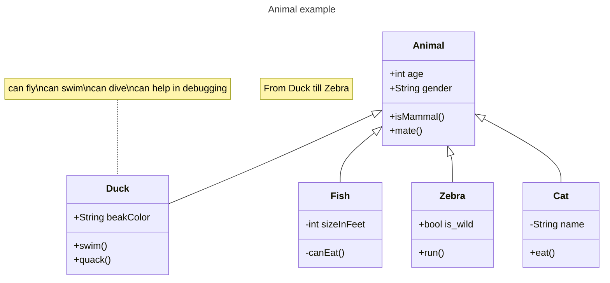
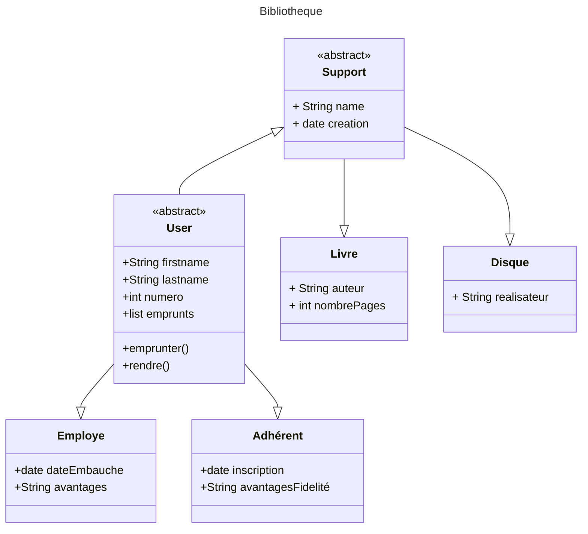

# projet-mermaid-uml

```mermaid

---
title: Animal example
---
classDiagram
    note "From Duck till Zebra"
    Animal <|-- Duck
    note for Duck "can fly\ncan swim\ncan dive\ncan help in debugging"
    Animal <|-- Fish
    Animal <|-- Zebra
    Animal <|-- Cat
    Animal : +int age
    Animal : +String gender
    Animal: +isMammal()
    Animal: +mate()
    class Duck{
        +String beakColor
        +swim()
        +quack()
    }
    class Fish{
        -int sizeInFeet
        -canEat()
    }
    class Zebra{
        +bool is_wild
        +run()
    }
    class Cat{
        -String name
        +eat()
    }

```

```mermaid
---
title: Bibliotheque
---
classDiagram
    User --|>Employe
    User --|>Adhérent
    Support --|>Livre
    Support --|>Disque
    Support <|-- User
    class User
    <<abstract>> User
    User : +String firstname
    User : +String lastname
    User : +int numero
    User : +list emprunts
    User : +emprunter()
    User : +rendre()
    class Employe{
        +date dateEmbauche
        +String avantages
        
    }
    class Adhérent{
        +date inscription
        +String avantagesFidelité
    }
    class Support
    <<abstract>> Support
    Support : + String name
    Support : + date creation
    class Livre{
        + String auteur
        + int nombrePages
    }
    class Disque{
        + String realisateur

    }

    
```
